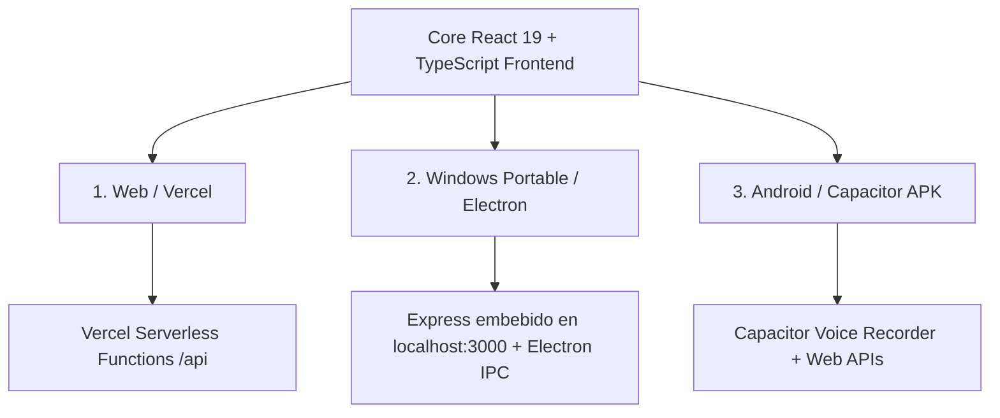
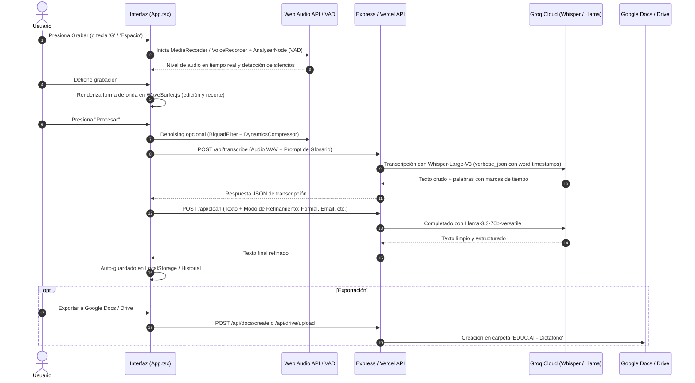

# 🎙️ Dictáfono AI — EDUC.AI

> **Sistema Inteligente de Captura, Procesamiento DSP, Transcripción y Refinamiento de Voz a Texto**  
> Desarrollado para **Web (Vercel)**, **Desktop Portable (Electron / Windows)** y **Android (Capacitor APK)**.

---

## 📑 Tabla de Contenidos
1. [Resumen del Proyecto](#-resumen-del-proyecto)
2. [Arquitectura de las 3 Versiones](#-arquitectura-de-las-3-versiones)
3. [Flujo Técnico de la Aplicación (Paso a Paso)](#-flujo-técnico-de-la-aplicación)
4. [Módulos Principales del Frontend](#-módulos-principales-del-frontend)
5. [Endpoints del Backend Serverless y Express](#-endpoints-del-backend)
6. [Glosario Dinámico y Validación Contextual](#-glosario-dinámico-y-validación-contextual)
7. [Accesibilidad y Experiencia de Usuario (UI/UX)](#-accesibilidad-y-experiencia-de-usuario-uiux)
8. [Instalación y Despliegue](#-instalación-y-despliegue)
9. [Variables de Entorno](#-variables-de-entorno)
10. [Licencia y Autor](#-licencia-y-autor)

---

## 🌟 Resumen del Proyecto

**Dictáfono AI** es una solución profesional diseñada para capturar ideas, conferencias, reuniones o dictados médicos/académicos en audio de alta fidelidad, aplicando reducción de ruido mediante DSP (Procesamiento Digital de Señales), transcripción automática palabra por palabra con marcas de tiempo (Whisper V3 Large a través de Groq API) y refinamiento contextual asistido por LLM (Llama 3.3).

La aplicación cuenta con sincronización en la nube (Google Drive y Google Docs), guardado automático persistente local, modo de lectura inmersiva con soporte de temas y navegación accesible mediante teclado y lectores de pantalla.

---

## 🏗️ Arquitectura de las 3 Versiones

La aplicación está construida sobre una arquitectura **monorepo unificada** con una sola base de código en React 19 + TypeScript + Tailwind CSS, adaptada para tres entornos de ejecución:



### 1. Versión Web (Vercel)
- **Frontend**: Compilado estáticamente con Vite en `/dist`.
- **Backend**: Funciones Serverless de Vercel desplegadas desde `/api/index.ts`.
- **CORS y Red**: Comunicación directa mediante rutas relativas `/api/*`.

### 2. Versión Portable / Windows (`Electron + Express`)
- **Backend Embebido**: `main.js` inicia un servidor local Express en `127.0.0.1:3000`.
- **Sincronización Asíncrona**: Electron espera el evento `listening` de Express antes de inicializar la ventana (`BrowserWindow.loadURL`), asegurando que todos los endpoints estén disponibles desde el primer milisegundo.
- **Distribución**: Empaquetado como ejecutable portable independiente sin instalador mediante `electron-builder`.

### 3. Versión Móvil / Android (`Capacitor APK`)
- **Grabación Nativa**: Emplea `capacitor-voice-recorder` para gestionar permisos de micrófono nativos (`RECORD_AUDIO`) y retención de energía en segundo plano.
- **Navegación Móvil Táctil**: Dispone de barra de navegación inferior adaptada a zonas de alcance de pulgar (*Thumb Zone*), soporte de gestos y modales superpuestos de pantalla completa.

---

## 🔄 Flujo Técnico de la Aplicación

El ciclo de vida de un dictado sigue el siguiente flujo de estados:



---

## 🧩 Módulos Principales del Frontend

| Módulo | Archivo / Componente | Descripción |
|---|---|---|
| **Motor de Audio y DSP** | `App.tsx` | Decodificación PCM, filtrado pasa-altos a 80 Hz, compresión dinámica de picos y conversión bidireccional entre `AudioBuffer` y `Blob (WAV)`. |
| **VAD (Voice Activity Detection)** | `App.tsx` | Medición en tiempo real mediante `AnalyserNode` (`0-255`) con advertencia de silencio prolongado y ganancia ajustable por software. |
| **Editor de Onda Visual** | `WaveSurfer.js + Regions` | Visualización interactiva que permite recortar fragmentos, eliminar secciones con errores de voz y reproducir audio desde cualquier punto. |
| **Modos de Refinamiento IA** | `REFINEMENT_MODES` | Modos predefinidos: *Estándar*, *Literal*, *Email Formal*, *Lista de Puntos*, *Académico*, *Creativo* y *Ultra-Limpio*. |
| **Modo Presentación / Lectura** | `AnimatePresence / Reader` | Pantalla completa con tipografía optimizada, navegación por teclado (`↑`/`↓`/`Esc`) y selector de paletas (*Claro*, *Oscuro*, *Sepia*). |
| **Gestor de Glosario** | `GlossaryModal` | Inyección de términos técnicos y marcas en el `prompt` de Whisper para garantizar ortografía exacta de palabras complejas. |

---

## 📡 Endpoints del Backend

Todas las rutas están centralizadas en [`api/index.ts`](api/index.ts) (Web) y [`main.js`](main.js) (Electron):

### 1. `GET /api/config`
- **Propósito**: Verifica el estado de conectividad del servidor, la validez del formato de la clave Groq y la disponibilidad de credenciales de Google OAuth.
- **Respuesta**:
  ```json
  {
    "hasServerApiKey": true,
    "isApiKeyValidFormat": true,
    "isHardcoded": false,
    "hasGoogleConfig": true
  }
  ```

### 2. `POST /api/transcribe`
- **Formato**: `multipart/form-data` (archivo `file`, `model`, `language`, `prompt`).
- **Motor**: Groq Whisper Large V3 con granularidad a nivel de palabra (`word timestamps`).
- **Respuesta**: Texto transcrito y arreglo detallado de palabras con tiempos de inicio y fin (`start`/`end`).

### 3. `POST /api/clean`
- **Formato**: `application/json` con `messages` y `temperature: 0.2`.
- **Motor**: Groq Llama 3.3 70B Versatile.
- **Propósito**: Corrección gramatical, puntuación profesional y formateo según el modo seleccionado.

### 4. `POST /api/docs/create` & `POST /api/drive/upload`
- **Protocolo**: Google Drive & Docs API v3/v1 con OAuth2.
- **Comportamiento**: Crea o localiza automáticamente la carpeta `EDUC.AI - Dictáfono` en el Google Drive del usuario para almacenar los archivos generados.

---

## 📚 Glosario Dinámico y Validación Contextual

Whisper permite condicionar su vocabulario fonético mediante el parámetro `prompt`. Dictáfono AI aprovecha esta capacidad inyectando dinámicamente los términos del glosario activo:

1. El usuario registra términos específicos (ej. *"EDUC.AI"*, *"Vibe Coding"*, nombres propios).
2. Al transcribir, `getGlossaryPrompt()` une los términos seleccionados y los envía en la cabecera del modelo.
3. Esto previene transcripciones erróneas en palabras poco frecuentes o jerga técnica.

---

## ♿ Accesibilidad y Experiencia de Usuario (UI/UX)

La interfaz cumple con los estándares **WCAG 2.2 Nivel AA** y principios de usabilidad de Nielsen Norman Group:

- **Tamaño de Objetivo Táctil (Fitts's Law / WCAG 2.5.5)**: Todos los controles interactivos tienen una dimensión mínima de **44×44 CSS px** para un uso fiable con una mano en smartphones y pantallas táctiles.
- **Navegación por Teclado e Indicadores Visibles (WCAG 2.4.7)**: Sistema de enfoque `:focus-visible` con anillo azul de alto contraste.
- **Atajos Rápidos de Teclado**:
  - <kbd>G</kbd> o <kbd>Espacio</kbd>: Iniciar / Detener grabación o Procesar audio.
  - <kbd>Esc</kbd>: Salir del Modo Lectura / Cerrar modales.
  - <kbd>↑</kbd> / <kbd>↓</kbd>: Desplazamiento suave en Modo Lectura.
- **Regiones ARIA Live (`role="status" aria-live="polite"`)**: Los estados de procesamiento son anunciados en tiempo real a tecnologías de asistencia como TalkBack y NVDA.
- **Soporte `prefers-reduced-motion`**: Desactiva animaciones complejas para usuarios con sensibilidad vestibular.

---

## 🚀 Instalación y Despliegue

### Requisitos Previos
- **Node.js** v18+ y **npm**.

### 1. Ejecución en Desarrollo (Local)
```bash
# Instalar dependencias
npm install

# Iniciar servidor de desarrollo (Frontend + Backend)
npm run dev
```

### 2. Compilación para Producción Web
```bash
npm run build
```

### 3. Compilación para Windows (Portable e Instalador)
```bash
npm run dist
```
Los ejecutables se generarán en la carpeta `/dist_electron`.

### 4. Sincronización con Android (Capacitor)
```bash
npm run build
npx cap sync android
npx cap open android
```

---

## 🔑 Variables de Entorno

Crea un archivo `.env` en la raíz del proyecto basándote en `.env.example`:

```env
# Clave de API de Groq Cloud (Obligatoria para transcripción e IA)
GROQ_API_KEY=gsk_tu_clave_de_groq_aqui

# Configuración de Google OAuth (Opcional, para exportación a Docs/Drive)
GOOGLE_CLIENT_ID=tu_cliente_id.apps.googleusercontent.com
GOOGLE_CLIENT_SECRET=tu_cliente_secreto
APP_URL=http://localhost:3000
```

---

## 👨‍💻 Autor y Créditos

- **Autor**: Mariano Fischer
- **Organización**: [EDUC.AI](https://dictafono-ai-qxsnswy.gamma.site/)
- **Contacto / Feedback**: [educaailatam@gmail.com](mailto:educaailatam@gmail.com)
- **Tecnologías Clave**: React 19, TypeScript, Tailwind CSS, Vite, Groq Cloud (Whisper V3 & Llama 3), Electron, Capacitor.

